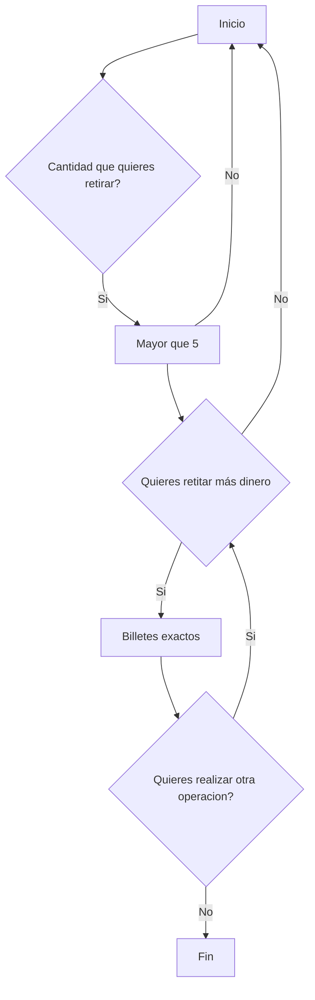
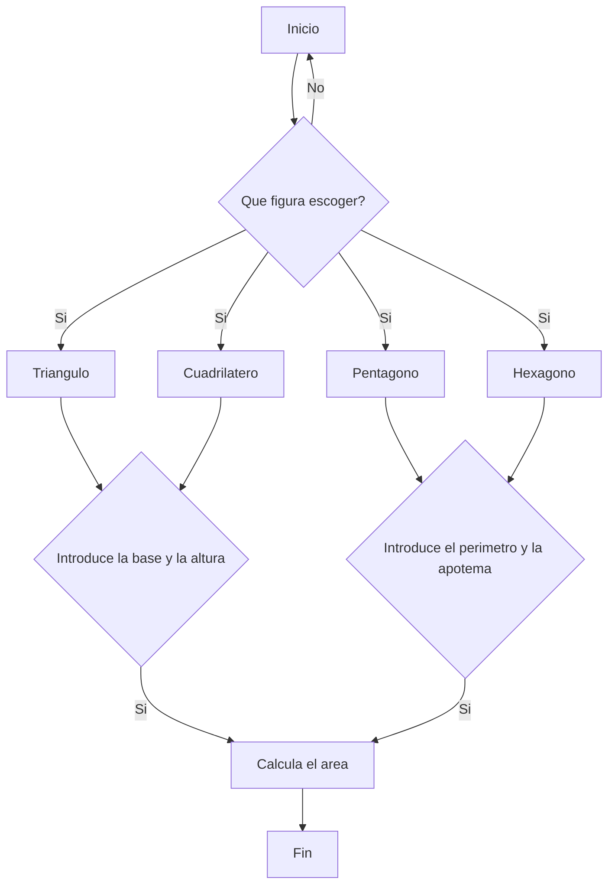

# diagrama

```mermaid
graph TD;
A[Inicio] --> B{Cantidad que quieres retirar?}
C-->|No|A
B-->|Si|C
C[Mayor que 5]
--> D{Quieres retitar más dinero}
D-->|Si|E
D-->|No|A
E[Billetes exactos]
--> G{Quieres realizar otra operacion?}
G-->|Si|D
G-->|No|H
H[Fin] 

```
------

# diagrama figuras geometricas

```mermaid
graph TD;
A[Inicio] --> B{Que figura escoger?}
B-->|Si|C
B-->|No|A
C[Triangulo]
B-->|Si|D
D[Cuadrilatero]
B-->|Si|E
E[Pentagono]
B-->|Si|F
F[Hexagono]
C--> G{Introduce la base y la altura}
D--> G{Introduce la base y la altura}
E--> H{Introduce el perimetro y la apotema}
F--> H{Introduce el perimetro y la apotema}
G-->|Si|I
H-->|Si|I
I[Calcula el area]
I--> J[Fin]


```
