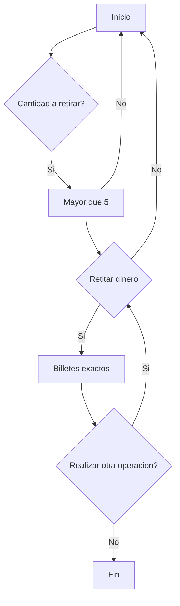

# diagrama

```mermaid
graph TD;
A[Inicio] --> B{Cantidad a retirar?}
C-->|No|A
B-->|Si|C
C[Mayor que 5]
--> D{Retitar dinero}
D-->|Si|E
D-->|No|A
E[Billetes exactos]
--> G{Realizar otra operacion?}
G-->|Si|D
G-->|No|H
H[Fin] 

```
------
